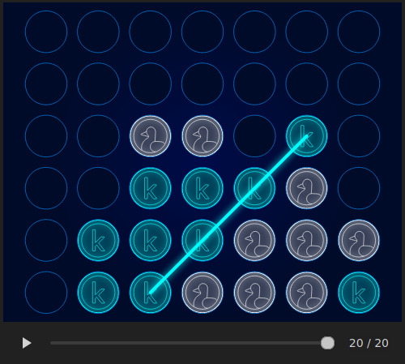
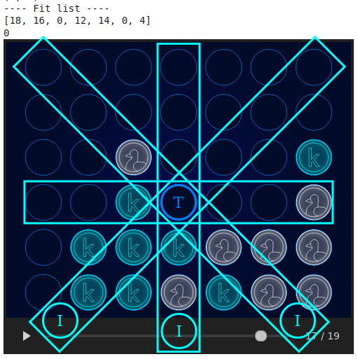
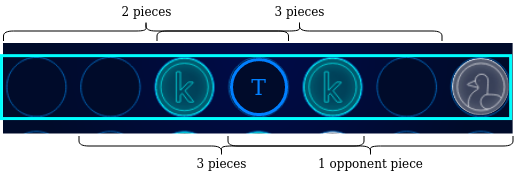
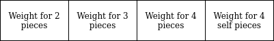

# ConnectX-VirtusUP
The project for the first module of Virtus Up AI training to develop agents for the Connect X game.

## The Challenge

Make an agent AI-based, with only heuristics and AI classic models like bayes net or genetic algorithm.

## The Agent

The agent was developed with an seven row strategy and optimized with an genetic algorithm.

The heuristics are based on weights used like **rewards**

### Seven Row

The strategy adopted is based on the influence of an piece in the table environment. To create 4 in a row, a new piece in the table can only search for pieces around 3 corners of their own location. When you join the 3 spaces in each direction and the location of the new piece an seven row is formed. To cover all possibillities, is formed an seven row for each horizontal, vertical and diagonal direction like in the next image.

#### Four Space Filter

To avaliate a seven row, a filter of four spaces is passed through the array and are 5 possible results:

- In the four spaces is there one opponent piece: Makes impossible any try of an 4 connection, so it not rewards the piece placement
- In the four spaces is just one piece: The piece is the one that is been placed, so this situation is also not rewarded
- In the four spaces are there two pieces: Brings some value to the piece placement, but not help so much to win the game
- In the four spaces are there three pieces: Indicates that the piece placement help the agent to win the game
- In the four spaces are there four pieces: The piece placement win the game

The image beyond shows the result of the filter applications in an seven row.

The result of the sum of points attributed to each four space filter is the value of the seven row.

But how to define these rewards? Is visible an hierarchy between them, but the specific values which determine the best agent is only empirically found. To find these optimal rewards where used an genetic algorithm. 

### Genetic Algorithm

The genetic algorithm was initially designed to have the weights like gene pool, and the fitness function to evaluate an chromosome is the quantity of wins achieved against pre defined oponents in 10 plays with each.

The genes are in a 1 to 50 range.

The next image shows the model adopted to the chromosome.

